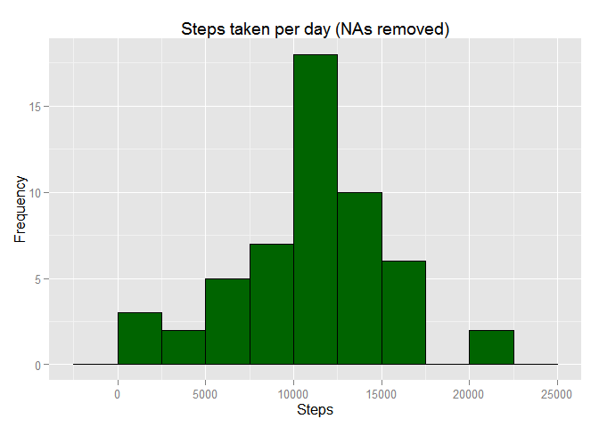
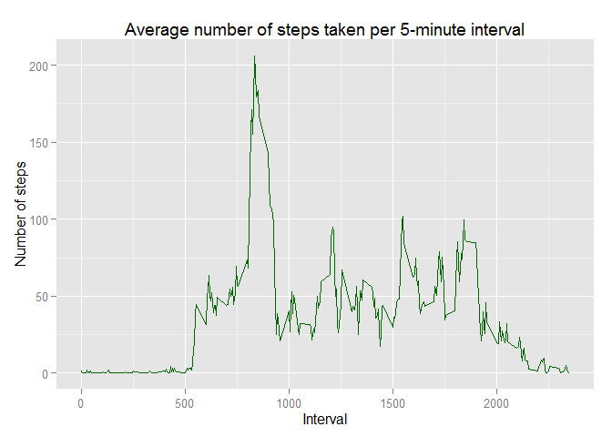
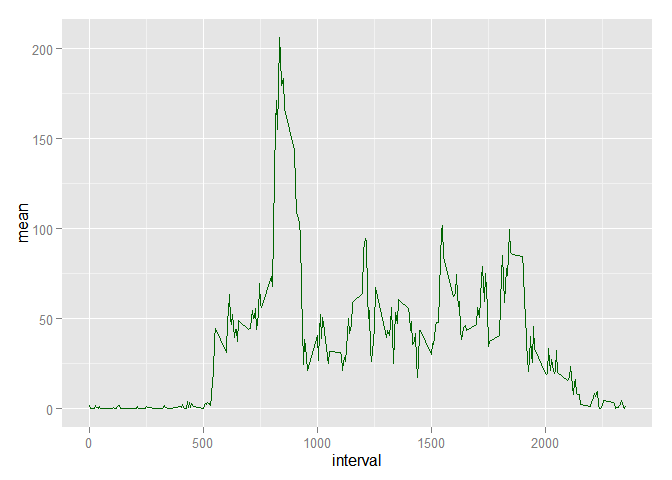
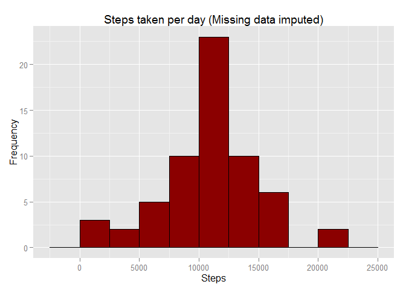
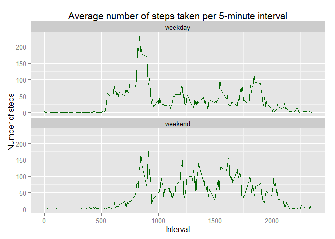

# Reproducible Research: Peer Assessment 1

```r
library(data.table)
library(dplyr)
```

```
## 
## Attaching package: 'dplyr'
## 
## The following objects are masked from 'package:data.table':
## 
##     between, last
## 
## The following object is masked from 'package:stats':
## 
##     filter
## 
## The following objects are masked from 'package:base':
## 
##     intersect, setdiff, setequal, union
```

```r
library(lubridate)
```

```
## 
## Attaching package: 'lubridate'
## 
## The following objects are masked from 'package:data.table':
## 
##     hour, mday, month, quarter, wday, week, yday, year
```

```r
library(ggplot2)
```
## Loading and preprocessing the data

```r
data <- fread('activity.csv')
```

## What is mean total number of steps taken per day?

###1. Calculate the total number of steps taken per day:

```r
spd <- na.omit(data) %>% group_by(date) %>% summarise(n=sum(steps))
spd
```

```
## Source: local data table [53 x 2]
## 
##          date     n
## 1  2012-10-02   126
## 2  2012-10-03 11352
## 3  2012-10-04 12116
## 4  2012-10-05 13294
## 5  2012-10-06 15420
## 6  2012-10-07 11015
## 7  2012-10-09 12811
## 8  2012-10-10  9900
## 9  2012-10-11 10304
## 10 2012-10-12 17382
## ..        ...   ...
```

###2. Make a histogram of the total number of steps taken each day

```r
#hist(spd$n,main="Steps taken per day (NAs removed)",xlab="steps",col="darkgreen")
qplot(spd$n, geom="histogram",binwidth = 2500,fill=I("darkgreen"),col=I("black"),ylab="Frequency",xlab="Steps",main="Steps taken per day (NAs removed)")
```

 

###3. Calculate and report the mean and median of the total number of steps taken per day

```r
mean_spd <- mean(spd$n,na.rm=TRUE)
median_spd <- median(spd$n,na.rm=TRUE)
spd
```

```
## Source: local data table [53 x 2]
## 
##          date     n
## 1  2012-10-02   126
## 2  2012-10-03 11352
## 3  2012-10-04 12116
## 4  2012-10-05 13294
## 5  2012-10-06 15420
## 6  2012-10-07 11015
## 7  2012-10-09 12811
## 8  2012-10-10  9900
## 9  2012-10-11 10304
## 10 2012-10-12 17382
## ..        ...   ...
```

```r
options(scipen=1, digits=2)
```

The mean of the total number of steps taken per day is **10766.19**.  
The median of the total number of steps taken per day is **10765**.

## What is the average daily activity pattern?

###1. Make a time series plot (i.e. type = "l" ) of the 5-minute interval (xaxis) and the average number of steps taken, averaged across all days (yaxis)

```r
avnust <- na.omit(data) %>% group_by(interval) %>% summarise(mean = mean(steps))
plot(avnust$interval,avnust$mean,type ="l",main="Average number of steps taken per 5-minute interval",xlab="Interval",ylab="Number of steps")
```

 

```r
ggplot(avnust, aes(interval,mean))+geom_line(color="darkgreen")
```

 

###2. Which 5-minute interval, on average across all the days in the dataset, contains the maximum number of steps?

```r
peak = avnust$interval[avnust$mean==max(avnust$mean)]
value = max(avnust$mean)
```

The 5-minute interval which, on average across all the days in the dataset, contains the maximum number of steps is the number **835** with an average of **206.17** steps. 

## Imputing missing values

###1. Calculate and report the total number of missing values in the dataset (i.e. the total number of rows with NAs)

```r
nofnas <- sum(is.na(data$steps))
```

The total number os missing values in the dataset is **2304**.

###2. Devise a strategy for filling in all of the missing values in the dataset. The strategy does not need to be sophisticated. For example, you could use the mean/median for that day, or the mean for that 5-minute interval, etc.

The strategy is the use of the average number of steps of the same day of the week and the same interval.


```r
base <- na.omit(data) %>% mutate(wday=wday(date)) %>%
  group_by(wday,interval) %>% summarise(mean=as.integer(mean(steps)))
```


###3. Create a new dataset that is equal to the original dataset but with the missing data filled in.

```r
NAdata <- mutate(data,wday=wday(date)) %>% filter(is.na(steps))
noNAdata <- na.omit(data) %>% mutate(wday=wday(date))
setkey(base,wday,interval)
setkey(NAdata,wday,interval)
x <- base[NAdata]
NAdata <- select(x,mean,date,interval,wday)
setnames(NAdata,"mean","steps")
L = list(NAdata,noNAdata)
newdata <- rbindlist(L) %>% arrange(date,interval)
```

###4. Make a histogram of the total number of steps taken each day and Calculate and report the mean and median total number of steps taken per day. Do these values differ from the estimates from the first part of the assignment? What is the impact of imputing missing data on the estimates of the total daily number of steps?

```r
spd <- group_by(newdata,date) %>% summarise(n=sum(steps))
spd
```

```
## Source: local data table [61 x 2]
## 
##          date     n
## 1  2012-10-01  9888
## 2  2012-10-02   126
## 3  2012-10-03 11352
## 4  2012-10-04 12116
## 5  2012-10-05 13294
## 6  2012-10-06 15420
## 7  2012-10-07 11015
## 8  2012-10-08  9888
## 9  2012-10-09 12811
## 10 2012-10-10  9900
## ..        ...   ...
```

```r
#hist(spd$n,main="Steps taken per day (NAs filled)",xlab="steps",col="darkblue")
qplot(spd$n, geom="histogram",binwidth = 2500,fill=I("darkred"),col=I("black"),ylab="Frequency",xlab="Steps",main="Steps taken per day (NAs filled)")
```

 

```r
newmean_spd <- mean(spd$n,na.rm=TRUE)
newmedian_spd <- median(spd$n,na.rm=TRUE)
```

The mean of the total number of steps taken per day is **10809.79**. Without the rows with NAs, the value was **10766.19**.  
The median of the total number of steps taken per day is **11015**. Without the rows with NAs, the value was **10765**.  

## Are there differences in activity patterns between weekdays and weekends?

###1. Create a new factor variable in the dataset with two levels - "weekday" and "weekend" indicating whether a given date is a weekday or weekend day.

```r
data2 <- na.omit(data) %>% mutate(wday=wday(date))
data2[wday %in% c(2:6),type:="weekday"]
```

```
##        steps       date interval wday    type
##     1:     0 2012-10-02        0    3 weekday
##     2:     0 2012-10-02        5    3 weekday
##     3:     0 2012-10-02       10    3 weekday
##     4:     0 2012-10-02       15    3 weekday
##     5:     0 2012-10-02       20    3 weekday
##    ---                                       
## 15260:     0 2012-11-29     2335    5 weekday
## 15261:     0 2012-11-29     2340    5 weekday
## 15262:     0 2012-11-29     2345    5 weekday
## 15263:     0 2012-11-29     2350    5 weekday
## 15264:     0 2012-11-29     2355    5 weekday
```

```r
data2[wday %in% c(1,7),type:="weekend"]
```

```
##        steps       date interval wday    type
##     1:     0 2012-10-02        0    3 weekday
##     2:     0 2012-10-02        5    3 weekday
##     3:     0 2012-10-02       10    3 weekday
##     4:     0 2012-10-02       15    3 weekday
##     5:     0 2012-10-02       20    3 weekday
##    ---                                       
## 15260:     0 2012-11-29     2335    5 weekday
## 15261:     0 2012-11-29     2340    5 weekday
## 15262:     0 2012-11-29     2345    5 weekday
## 15263:     0 2012-11-29     2350    5 weekday
## 15264:     0 2012-11-29     2355    5 weekday
```

###2. Make a panel plot containing a time series plot (i.e. type = "l" ) of the 5-minute interval (xaxis) and the average number of steps taken, averaged across all weekday days or weekend days (yaxis). 

```r
#avnust1 <- filter(data2,type=="weekday") %>%
#  group_by(interval) %>% summarise(mean = mean(steps))
#avnust2 <- filter(data2,type=="weekend") %>%
#  group_by(interval) %>% summarise(mean = mean(steps))
#par(mfrow=c(1,2))
#plot(avnust1$interval,avnust1$mean,type ="l",main="Weekday",xlab="Interval",ylab="Number of steps",ylim=c(0,200))
#plot(avnust2$interval,avnust2$mean,type ="l",main="Weekend",xlab="Interval",ylab="Number of steps",ylim=c(0,200))
#p <- group_by(data2,type,interval) %>% summarise(type,interval) 
avnust <- group_by(data2,type,interval) %>% summarise(mean = mean(steps))
ggplot(avnust, aes(interval,mean))+geom_line(color="darkgreen")+
    facet_wrap(~type, ncol=1)
```

 
