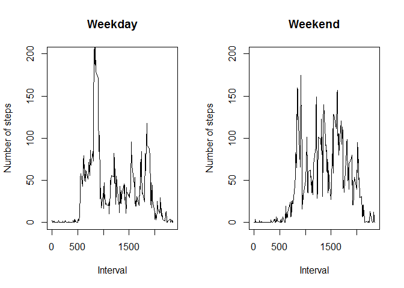

# Reproducible Research: Peer Assessment 1

```r
require(data.table)
```

```
## Loading required package: data.table
```

```r
require(dplyr)
```

```
## Loading required package: dplyr
## 
## Attaching package: 'dplyr'
## 
## The following objects are masked from 'package:data.table':
## 
##     between, last
## 
## The following object is masked from 'package:stats':
## 
##     filter
## 
## The following objects are masked from 'package:base':
## 
##     intersect, setdiff, setequal, union
```

```r
require(lubridate)
```

```
## Loading required package: lubridate
## 
## Attaching package: 'lubridate'
## 
## The following objects are masked from 'package:data.table':
## 
##     hour, mday, month, quarter, wday, week, yday, year
```
## Loading and preprocessing the data

```r
data <- fread('activity.csv')
```

## What is mean total number of steps taken per day?

###1. Calculate the total number of steps taken per day:

```r
spd <- na.omit(data) %>% group_by(date) %>% summarise(n=sum(steps))
spd
```

```
## Source: local data table [53 x 2]
## 
##          date     n
## 1  2012-10-02   126
## 2  2012-10-03 11352
## 3  2012-10-04 12116
## 4  2012-10-05 13294
## 5  2012-10-06 15420
## 6  2012-10-07 11015
## 7  2012-10-09 12811
## 8  2012-10-10  9900
## 9  2012-10-11 10304
## 10 2012-10-12 17382
## ..        ...   ...
```

###2. Make a histogram of the total number of steps taken each day

```r
hist(spd$n,main="Steps taken per day",xlab="steps",col="darkgreen")
```

 

###3. Calculate and report the mean and median of the total number of steps taken per day

```r
mean_spd <- mean(spd$n,na.rm=TRUE)
median_spd <- median(spd$n,na.rm=TRUE)
options(scipen=1, digits=2)
```

The mean of the total number of steps taken per day is **10766.19**.

The median of the total number of steps taken per day is **10765**.

## What is the average daily activity pattern?

###1. Make a time series plot (i.e. type = "l" ) of the 5-minute interval (xaxis) and the average number of steps taken, averaged across all days (yaxis)

```r
avnust <- na.omit(data) %>% group_by(interval) %>% summarise(mean = mean(steps))
plot(avnust$interval,avnust$mean,type ="l",main="Average number of steps taken per 5-minute interval",xlab="Interval",ylab="Number of steps")
```

 

###2. Which 5-minute interval, on average across all the days in the dataset, contains the maximum number of steps?

```r
peak = avnust$interval[avnust$mean==max(avnust$mean)]
value = max(avnust$mean)
```

The 5-minute interval which, on average across all the days in the dataset, contains the maximum number of steps is the number **835** with an average of **206.17** steps. 

## Imputing missing values

###1. Calculate and report the total number of missing values in the dataset (i.e. the total number of rows with NAs)

```r
nofnas <- sum(is.na(data$steps))
```

The total number os missing values in the dataset is **2304**.

###2. Devise a strategy for filling in all of the missing values in the dataset. The strategy does not need to be sophisticated. For example, you could use the mean/median for that day, or the mean for that 5-minute interval, etc.

The strategy is the use of the average number of steps of the same day of the week and the same interval.


```r
base <- na.omit(data) %>% mutate(wday=wday(date)) %>%
  group_by(wday,interval) %>% summarise(mean=mean(steps))
```


###3. Create a new dataset that is equal to the original dataset but with the missing data filled in.

```r
NAdata <- mutate(data,wday=wday(date)) %>% 
  filter(is.na(steps)) %>%
  mutate(steps = floor(base[((base$wday==wday) & (base$interval==interval))]$mean))
```

```
## Warning in `[.data.table`(`_dt`, , `:=`(steps, floor(base[((base$wday == :
## Supplied 2016 items to be assigned to 2304 items of column 'steps'
## (recycled leaving remainder of 288 items).
```

```
## Warning in `[.data.table`(`_dt`, , `:=`(steps, floor(base[((base$wday == :
## Coerced 'double' RHS to 'integer' to match the column's type; may have
## truncated precision. Either change the target column to 'double' first (by
## creating a new 'double' vector length 2304 (nrows of entire table) and
## assign that; i.e. 'replace' column), or coerce RHS to 'integer' (e.g. 1L,
## NA_[real|integer]_, as.*, etc) to make your intent clear and for speed.
## Or, set the column type correctly up front when you create the table and
## stick to it, please.
```

```r
NAdata$steps
```

```
##    [1]   0   0   0   0   0   1   3   0   0   0   0   0   0   0   0   0   0
##   [18]   0   0   0   1   0   0   0   0   0   6   0   0   0   0   1   0   0
##   [35]   1   5   0   0   0   0   0   0   0   0   0   0   0   0   0   0   6
##   [52]   0   0   0   0   0   0   0   0   0   0   0   1   0   0   0   7  21
##   [69]  82  84  89  86  85  87  86  95  28  14  25  32  18  22  43  32  59
##   [86]  46  20  29  47  31  30  49  26  93 101  90  55  89 149 176 170 140
##  [103] 163 154 177 156 116 199 134 110  42  27  41  57  48   6  36  27  43
##  [120]   0  25   0  51 137  55  32  41   5  17  53   9  21  28  20   1   9
##  [137]   2   3   6  16   4  51  54  43  85  50  95  78  19  48  42   0   6
##  [154]   1  25 102  25   9  11   3  34  35  48  60  24  28   9  18  20  51
##  [171]  61 121  65  62  50   1  16  48  53  62  17  31   2  27  40  29  14
##  [188]  14  12  42   0   0  56  45   6   0   2  13   2  16   6   6  59  35
##  [205]  42 110  50  72  65  44  76  47  75   7   5  25  15  14  36  32  36
##  [222]  24  75  84 129 107 131  82  80  83  48  24  22  15  23  81  71  28
##  [239]  58  31   0   0   6  13   5   0   0  10  11   0  10   4   7  40  52
##  [256]  30  23   4   4  11   3  31  30   6   0  12  13   1  10   1  10   6
##  [273]   0   0   0   0  11   3   0   0   0   4  10   5   7   0   0   2   4
##  [290]   2   0   0   0   0   0   0   0   9   1   0   2   0   0   0   0   0
##  [307]   0   0   0   0   0   0   0   0   0   0   0   0   0   0   0   0   0
##  [324]   0   0   0   0   0   0   0   0   1   0   0   0   0   0   0   0   0
##  [341]   0   0   9   0   0   0   0   0   0   5   4   0   0   7   0  10   2
##  [358]   4  62 129  86 144 159 167 171 167 192 123 128 162  95 125 104  87
##  [375] 141 151 128 127 136 133  72 117 127 123 227 134 116 215 262 266 276
##  [392] 273 265 151 108 172 137  28  25  48 144  32  22  36   2  14  18  48
##  [409]  77  34  96  66  42  42  70  25  13  22  21  12   3   2   2  33  58
##  [426]   0  23  32  11   0  17  25  23  67  61  62 107  97 102  11   0   0
##  [443]   9  69  23  27  20   1   1  47  19   0   8  12  12   2   8   4  32
##  [460]  14  14  57  54  13  16   2  40   1   1   5  10   7  28  23  33  25
##  [477]  49 106  94  15   7  18  61  27   2   0   7   2   3   0   0  40  21
##  [494]  51  71  80 136 201  89 123 201 166  29  29  12  16  15  80  64  62
##  [511]  29  37  68  85 141 120 129 109 136 119  80  46  42  11   6  21  36
##  [528]   4  22   6   3  13  12   7  14   1   6  15  18   0  22  16  11  15
##  [545]   4   0  13  16   5   2   0   0   0   0   0  33  13   1   2   0   0
##  [562]   0   0   0   0   0   0   2   0   1   3   3   0   1   1   3   5   0
##  [579]   0   1   0   1   0   5   0   0   0   0   0   0   1   0   0   7   6
##  [596]   0   0   0   0   0   0   0   0   0   0   0   0   0   0   0   0   0
##  [613]   0   0   0   0   0   4   1   1   0   0   0   0   0   0   0   0   1
##  [630]   0   0   0  17   1   8   0   0   0   0   2   7   6   0   0   0   0
##  [647]   2   2   0   3   7   7   4  14  13  25  21   6  14  34  10   5  15
##  [664]  21  19  11  28  32  23  28  25  15  43  49 234 283 232 237 185 252
##  [681] 264 241 225 133 137 111  84  77 127 141  69  26  67  38  37   0   0
##  [698]   0  10   0   0   8   7   0   0   5   5  22  26  35   9   8  19  42
##  [715]   9   0   6   4  17  17  27  15   0  29  14  14   8  19  10   0   0
##  [732]   0   0   0   3   0  12   0   2   0  10  65  16   0   2  11   0   3
##  [749]   3  10  16  28   9   8   2  21  44  38   0   0   3   1   9  62 235
##  [766] 171 269 196  91  83  85  73  86  73  67  62  61  67  23  12   9  17
##  [783]   9   9  25  13  14  11  23  18  30  24  46 112 114 110  28  36  23
##  [800]   9  42  83  66  85 106 131  85  77  47  14  41  77  40  15  66  55
##  [817]   7   3  13   9   2   1   8   2   9  13   9   4   3  13  27  10  23
##  [834]  13  13   1  10   0   2   1   6   4   5  11   0   0   0   0   0   0
##  [851]   0   0   1  12   0   3   6   2   0   0   2   0   0   0   0   0   0
##  [868]   0   0   0   0   0   0   0   1   0   0   0   0   0   0   0   5   0
##  [885]   0   1   2   0   0   0   0   0   0   1   0   0   0   0   4   0   0
##  [902]   0   0   0   0   0   0   0   0   0   0   0   0   5   0   0   1   0
##  [919]   6   0   1   2   2   1   0   5  14   9   5   0   0   2   8  18   0
##  [936]   9  13   4  15  24  15  19   8   4  31  19  13  18   5  10  13  30
##  [953]  11  16  52  33  61  47  59  66  63  37 165 223 257 261 273 279 233
##  [970] 234 328 192 218 135  60  93  31   2   9  19  12  33  28   6  72  54
##  [987]  26   7  17  82  31  82  69  15  39  48  20  48  21   0  21  59  44
## [1004]  94  63  39   9  70  56 141 219  92  50  45  89 120  88 127 126  95
## [1021]  63  85  70  59 125 140  79  50  75  86  79 155 199 117  53  70  41
## [1038]   7  20  16   3  43 108  94  98  94 125 122 127 111 158 142 169 157
## [1055] 100 135  58  56 111  32  18  17  18   2  45  73  28  64  18  11   7
## [1072]  18   4   8  20  69  50  31  18  26  24  72 133 159 149 214 210 205
## [1089]  94 141  62  30  24  22  12  27  35  14  21  20  18  13  42  17  17
## [1106]   8   1   9   9   2   4  10   0   6   4  15  10  18  24   8   0   0
## [1123]   0   0   0   0   0   0   1   4  13   1   0   3   1   0   0   0   2
## [1140]   9   2   0   0   0   0   0   0   0   0   0   0   1   0   0   0   0
## [1157]   0   0   0   0   0   0   0   0   0   0   0   0   0   0   0   0   0
## [1174]   0   0   0   0   0   0   0   0   0   0   0   0   0   0   0   0   0
## [1191]   0   0   1   0   5   1   1   0   0   0   0   0   7   0   0   2  13
## [1208]   4   0   1   4   3   0   0   0   0   0   7   0   0   3   2   6   7
## [1225]   0   0   0  23   8   5   0  11   9   3   5  19  28  25   9   7   0
## [1242]  21  38  12   7  16  17   2  23  31  51  38  28  61  92 155 143 215
## [1259] 209 220 112 213 238 276 174 158 149 123  17  22  14   3   2   8   4
## [1276]  13   2   4  12   0  12   7   0  30  40  16  31  41  12  18  16  44
## [1293]  21  25  18  32  55  79 122 158 129  48  27  13  22  74  94 133 111
## [1310]  65  73 120  95 106  91  55  53  81 202 187 130 149 138  87 116 108
## [1327] 138 101  37  28  37  98  39  14  16  20   2  17  60 118  45  77 116
## [1344] 124 123 113 111 120 125 123  36  25  95 132 110  55 111 106 122 139
## [1361] 134 130 109  27  81  33  26  55 129 142 143 167  68  73 123  80 102
## [1378]  55  24  31  45  51  11   8  34  24  16   5  34  89  70  94  69  75
## [1395]  78  95  71  76  80 113  78  76  93  39  22   9   6  14  10   6  14
## [1412]  15  16   0  15   0   0   0   0   0   0   3   0   0   0   0   0   0
## [1429]   0   0   0   0   0   0   0   0   0   0   0   0   0   0   0   0   0
## [1446]   7   0   0   0   0   0   1   0   5   0   0   0   0   1   1   0   1
## [1463]   0   0   0   0   0   0   0   0   0   0   0   0   0   0   0   0   0
## [1480]   0   0   0   0   0   0   0   0   0   8   0   0   0   0   0   0   0
## [1497]   5   0   6   1   0   0   0   4   0   0   0   0   0   0   2   5   0
## [1514]   0   2  15   2   5  12  12   3  15   7   5  16  21  18   6  15  28
## [1531]   4  11  30  33  34  42  63  80 113 119 124  68 123 101 100 104 106
## [1548]  49  19  23  76  73  34  56  32  27  14  41  28  61  96 102 101 122
## [1565] 130 198 147 159 129  64  69  89  84  72  73  69  71  52  54  53  46
## [1582]  42  47 105 124 191 138 139  92  73  29  62  60  54  74  69  86 105
## [1599] 133 124  65  81  64   7 121 111  32  91  38  34  22  33   5  10  11
## [1616]  37  33  50  61  24  15  63  90 102 128 145  74 104  71 138 139 131
## [1633]  98 136 152 180 182 190 188 159 114  45 101 104 130  79  85  67  91
## [1650]  69 111  52  18  61  44  18  42  46  54  20  36  25  21  21  27  40
## [1667]  54 108 107 107  76  91  27  18  27  36  26   6  29  12   9  49  40
## [1684]  94  98  64  86  20  28  19  12  19  39  14   7  25   2   9  26  16
## [1701]  10  16   0   0   2   2   0   0   0   0   0   0   2   0   1  25   5
## [1718]   0   0   0   0   1   2  25  13   3   0   0   1   0   0   0   0   5
## [1735]   0   0   0   0   0   0   0   0   0   2   0   0   0   0   0   0   0
## [1752]   0   0   0   0   0   0   0   0   0   0   0   5   0   0   0   0   0
## [1769]   0   0   5   0   2   0   0   0   0   1   3   0   0   0   0   0   0
## [1786]   0   0   2   0   0   0   0  10   0   6   3   0   3 101  51  17  87
## [1803]  87  95 115  99 106  59  92  73  74 104  75 112 135 133 122 121  98
## [1820]  25 153 142  22  39  24  42  55  14 101  29 114 225 172 155 212 197
## [1837] 249 265 269 196 181 237 143  92  16 100  72  32  14   0   0   1  24
## [1854]   0   2   5  14  25  37   6  21  19  19  22  17  18  91 127 161 158
## [1871] 163 134  78  92  45 106  44  23  85  13  10  27   1   0   0   2   8
## [1888]   0   3   0   0   0   0   1   0   0  14   8   0   0   0   0   0   2
## [1905]   5   0   5   8   0   9  21   6   1  20   4   9   0   2   1   2   3
## [1922]   3  12  29   0  20   0   9   0   8   6   0   4   8  11  41  50  86
## [1939]  64  87  63  80  97  89  24  11  38  38  42  54  74  92 129 184 108
## [1956] 138  93  25  22  18   1  10  15  33   4   4  10  19  17   0   0   9
## [1973]   0   5   8   0   8  27  89  67  10   2  27  28  18  23  33  58  15
## [1990]   0   4  10   0   0   0  11  24  55  56   8   0   0   8   0   0   2
## [2007]   0   0   0   0   0   0   0   0   0   0   0   0   0   0   0   1   3
## [2024]   0   0   0   0   0   0   0   0   0   0   0   0   0   1   0   0   0
## [2041]   0   0   6   0   0   0   0   1   0   0   1   5   0   0   0   0   0
## [2058]   0   0   0   0   0   0   0   0   0   6   0   0   0   0   0   0   0
## [2075]   0   0   0   0   1   0   0   0   7  21  82  84  89  86  85  87  86
## [2092]  95  28  14  25  32  18  22  43  32  59  46  20  29  47  31  30  49
## [2109]  26  93 101  90  55  89 149 176 170 140 163 154 177 156 116 199 134
## [2126] 110  42  27  41  57  48   6  36  27  43   0  25   0  51 137  55  32
## [2143]  41   5  17  53   9  21  28  20   1   9   2   3   6  16   4  51  54
## [2160]  43  85  50  95  78  19  48  42   0   6   1  25 102  25   9  11   3
## [2177]  34  35  48  60  24  28   9  18  20  51  61 121  65  62  50   1  16
## [2194]  48  53  62  17  31   2  27  40  29  14  14  12  42   0   0  56  45
## [2211]   6   0   2  13   2  16   6   6  59  35  42 110  50  72  65  44  76
## [2228]  47  75   7   5  25  15  14  36  32  36  24  75  84 129 107 131  82
## [2245]  80  83  48  24  22  15  23  81  71  28  58  31   0   0   6  13   5
## [2262]   0   0  10  11   0  10   4   7  40  52  30  23   4   4  11   3  31
## [2279]  30   6   0  12  13   1  10   1  10   6   0   0   0   0  11   3   0
## [2296]   0   0   4  10   5   7   0   0   2
```

###4. Make a histogram of the total number of steps taken each day and Calculate and report the mean and median total number of steps taken per day. Do these values differ from the estimates from the first part of the assignment? What is the impact of imputing missing data on the estimates of the total daily number of steps?


## Are there differences in activity patterns between weekdays and weekends?


###1. Create a new factor variable in the dataset with two levels - "weekday" and "weekend" indicating whether a given date is a weekday or weekend day.

```r
data2 <- na.omit(data) %>% mutate(wday=wday(date))
data2[wday %in% c(2:6),type:="weekday"]
```

```
##        steps       date interval wday    type
##     1:     0 2012-10-02        0    3 weekday
##     2:     0 2012-10-02        5    3 weekday
##     3:     0 2012-10-02       10    3 weekday
##     4:     0 2012-10-02       15    3 weekday
##     5:     0 2012-10-02       20    3 weekday
##    ---                                       
## 15260:     0 2012-11-29     2335    5 weekday
## 15261:     0 2012-11-29     2340    5 weekday
## 15262:     0 2012-11-29     2345    5 weekday
## 15263:     0 2012-11-29     2350    5 weekday
## 15264:     0 2012-11-29     2355    5 weekday
```

```r
data2[wday %in% c(1,7),type:="weekend"]
```

```
##        steps       date interval wday    type
##     1:     0 2012-10-02        0    3 weekday
##     2:     0 2012-10-02        5    3 weekday
##     3:     0 2012-10-02       10    3 weekday
##     4:     0 2012-10-02       15    3 weekday
##     5:     0 2012-10-02       20    3 weekday
##    ---                                       
## 15260:     0 2012-11-29     2335    5 weekday
## 15261:     0 2012-11-29     2340    5 weekday
## 15262:     0 2012-11-29     2345    5 weekday
## 15263:     0 2012-11-29     2350    5 weekday
## 15264:     0 2012-11-29     2355    5 weekday
```

###2. Make a panel plot containing a time series plot (i.e. type = "l" ) of the 5-minute interval (xaxis) and the average number of steps taken, averaged across all weekday days or weekend days (yaxis). 

```r
avnust1 <- filter(data2,type=="weekday") %>%
  group_by(interval) %>% summarise(mean = mean(steps))
avnust2 <- filter(data2,type=="weekend") %>%
  group_by(interval) %>% summarise(mean = mean(steps))
par(mfrow=c(1,2))
plot(avnust1$interval,avnust1$mean,type ="l",main="Weekday",xlab="Interval",ylab="Number of steps",ylim=c(0,200))
plot(avnust2$interval,avnust2$mean,type ="l",main="Weekend",xlab="Interval",ylab="Number of steps",ylim=c(0,200))
```

 
